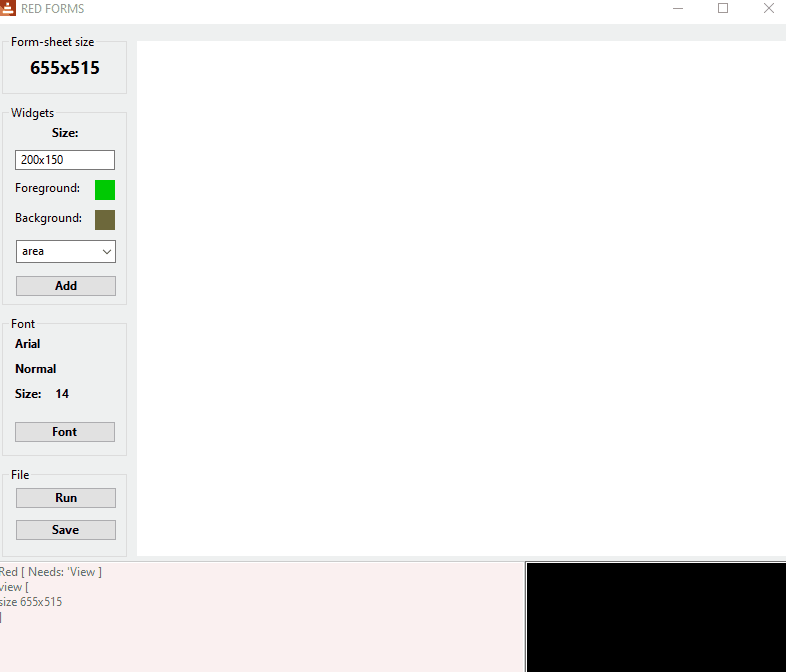

 
# $\color{#FFD700}{\text{✨ Forms:}}$ $\color{#7B68EE}{\text{a GUI design software}}$ $\color{#E3170D}{\text{in the Red programming language ✨}}$

 

    

---

This software facilitates GUI design in the Red programming language by generating Visual Interface Dialect (VID) code from the interface layout.
This process streamlines the design phase and simplifies widget positioning.
The application also supports the integration of custom user-provided code, allows for saving the complete codebase, and enables direct execution.

**Please note that this software is no longer actively maintained.**

REQUIREMENTS: NONE on Windows, the Red toolchain in other OSs, For Linux GTK Must be installed and running.

---

Download the latest Red toolchain from [www.red-lang.org](https://www.red-lang.org/p/download.html).

Alternatively, build the latest Red toolchain from [source](https://github.com/red/red/releases/latest).

---

To compile the saved code, run the following command from you operating console:

`<path_to_red_compiler> -t {windows|linux|macos} -r -o <where_to_save_the_executable> <path_to_your_code>`

---

Red language is an open source project made by Full Stack Technologies @ www.red-lang.org
